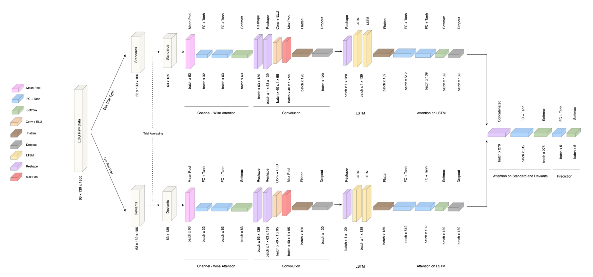

<h1 align="center">
Translational Neuromodeling - ETH - Course Project</h1>

  <a href="https://www.linkedin.com/in/eliatorre/">Elia Torre</a>,
  <a href="https://services.ini.uzh.ch/admin/modules/uzh/person.php?id=54155&back=../uzh/people">Linus Rüttimann</a>,
  <a href="https://www.linkedin.com/in/saurabh-vaishampayan-4647ba179/?originalSubdomain=ch">Saurabh Vaishampayan</a>
  
  
<a href="https://www.tnu.ethz.ch/de/home">Translational Neuromodeling Unit</a>, ETH Zürich, Switzerland

>**
 Abstract:** *This paper presents the work performed in the final project of the Translational Neuromodeling course. The purpose of our project is that of developing a computational approach to model EEG data measured during auditory mismatch negativity (MMN) studies in healthy subjects to which either receptor agonist or receptor antagonist drugs were administered. In order to do so, the data from (Weber et al., 2022) was pre-processed and several different computational models developed [Naive Classification, Laplacian Eigenmaps, Dynamic Causal Modeling (DCM), NeuralHGF and Convolutional Recurrent Attention Model (CRAM)]. The objective of such models is that of inferring which drug has been administered to a specific subject starting from the subject EEG measurements.*

## Introduction
The main focus of this paper is that of presenting the modeling techniques we developed to classify the EEG recordings of healthy subjects to which receptor agonist or antagonist drugs were administered in a auditory mismatch negativity (MMN) setting. In the following work, we will explain the dataset under analysis and the pre-processing perfomed on it. In particular, three different techniques to treat standard and deviant trials are discussed. Then, we developed five different modeling techniques starting from simpler techniques such as naive classification without embedding and with laplacian embedding. Passing by multiple Dynamic Causal Modeling (DCM) embedding architectures. To reach more complex neural network architectures such as a custom Convolutional Recurrent Attention Model (CRAM), and a novel technique to invert and simulate Hierarchical Gaussian Filter (HGF): NeuralHGF.

## Dataset
The dataset consisted out of EEG recordings from two auditory mismatch negativity (MMN) studies (Weber et al., 2022). In study 1 (antagonist branch) participants were given Biperiden (a selective muscarinic M1 receptor antagonist), amisulpride (a selective Dopaminergic D2/3 receptor antagonist) or placebo. In study 2 (agonist branch) subjects were given Galantamine (an acetylcholinesterase inhibitor), levodopa (a Dopamine precursor) or placebo. In both studies subject were presented with a sequence of 1800 auditory stimuli of two types. The presentation probability of the two stimuli was varying over the experiment. This was done to systematically test whether auditory mismatch responses under varying levels of environmental stability are sensitive to diminishing and enhancing cholinergic vs. Dopaminergic function. For all data analysis in this report we polled the data from the two studies which resulted in an unbalanced dataset of N = 51 placebo samples, N = 22 Biperiden samples, N = 24 amisulpride samples, N = 26 Galantamine and N = 26 levodopa samples (Ntotal = 149). The two studies were following exactly the same experimental protocol but data was collected independently. We decided to pool the data because of the small sample sizes and because we were interested in comparing agonist with antagonist samples. It should be noted thought that training a classifier on the pooled data bears the risk that the classifier learns to discriminate signal differences caused by slight differences in experimental conditions between the two studies rather than differences stemming from the the different drugs.

## Pre-Processing & Definition of Conditions
All data analysis in this report was performed on the pre-processed EEG data as provided by the course instructors. The following pre-processing steps were applied on the this data:
1. Rereferencing to linked mastoid.
2. High-pass filter 0.1 Hz
3. Downsampling to 250 Hz
4. Low-pass filter 30 Hz
5. Eye blink correction
6. Epoching between -100 and 452 ms relative to auditory stimulus
7. Rejection of bad trials (>75 μV).
   
We defined trial conditions by averaging the epoched trials in three different approaches (further specifications are provided in the paper associated with this repo): 
1. Classic Standard vs. Deviant (StdVsDev)
2. Classic Standard vs. Deviant with Stability (StdVsDevStb)
3. Extended Standard vs. Deviant (ExtStdVsDev)

For each subject, trials that fulfilled the condition criteria specified above were averaged to form one average trial per condition.

## Modeling Approaches
1. **Classification without Embedding**
2. **Laplacian Eigenmaps Embedding**
3. **Dynamic Causal Modeling (DCM)**
4. **Neural Hierarchical Gaussian Filter (NeuralHGF)**
5. **Convolutional Recurrent Attention Model (CRAM)**

## Classification without Embedding
The first modeling technique is a naive classification approach meant to give a baseline estimate of prediction accuracy. In particular, the data derived from the steps described in the previous section is further processed as follows:
1. Standard and Deviants are defined according to the first approach described in the Pre-Processing section to obtain 106 standard trials and 119 deviant trials.
2. Standard and deviant trials are averaged to obtain a data set of shape 149 subjects, 63 channels, 139 samples, 2 trial types.
3. Samples are then concatenated over the 2 trial types to obtain a data set of shape 149 subjects, 63 channels, 139 samples, 278 samples.
4. Finally, the data set is reshaped to 149 subjects, 17514 features.

This data set is then used to predict the drug (or placebo) given to every subject. In particular, we employed four machine learning models:
1. **K-Nearest Neighbors (KNN)**
2. **Random Forest (RF)**
3. **Support Vector Machine (SVM)**
4. **AdaBoost (ADB)**

Following (Schöbi et al., 2021), we ensured the validity of our models performances by comparison with the performance of 30 models trained under label permutations in a 10-fold cross-validation setting. For each classification, the best performing model has been cho- sen, a Gaussian curve has been fitted to the histograms of accuracies and the p-value estimated. In particular, we performed the following binary and multi-class classifications:
1. **Galantamine vs Placebo**
2. **Amisulpride vs Placebo**
3. **Levodopa vs Placebo**
4. **Biperiden vs Placebo**
5. **Biperiden vs Galantamine**
6. **Amisulpride vs Levodopa**
7. **All Drugs + Placebo**

The results are shown in the table below: 

This results show that this naive modeling technique achieves a good performance in differentiating Biperiden vs Placebo and Biperiden vs Galantamine. In particular, the models obtain an accuracy above 70% and a p-value < 0.05 in both the cases. However, it is a modeling techniques that lacks both of interpretability and robustness. 

## Laplacian Eigenmaps Embedding
Our second modeling approach is inspired by (Gramfort & Clerc, 2007) and (Belkin & Niyogi, 2003), which exploit Laplacian Eigenmaps as a dimensionality reduction technique. Laplacian Eigenmaps is a non-linear dimensionality reduction technique that aims at preserving the local structure of high-dimensional data in a lower-dimensional latent space. In the case of EEG data, we aim to preserve the complex spatial and temporal dependencies embedded in the data. Furthermore, this technique has been proven to be robust to noise. For what concerns the pre-processing of the data, we followed the same pipeline used for the classi- fication without embedding, i.e.:
1. Standard and Deviants are defined according to the first approach described in the Pre-Processing section to obtain 106 standard trials and 119 deviant trials.
2. Standard and deviant trials are averaged to obtain a data set of shape 149 subjects, 63 channels, 139 samples, 2 trial types.
3. Samples are then concatenated over the 2 trial types to obtain a data set of shape 149 subjects, 63 channels, 139 samples, 278 samples.
4. The data set is reshaped to 149 subjects, 17514 features.
5. Finally, we apply the Laplacian Dimensionality Reduction technique to obtain a data set of shape 149 subject, 2 features.

The evaluation scheme is consistent with the previously described one. The results are shown in the table below:

This results show that a laplacian-eigenmaps-based technique achieves an overall level of accuracy that is inferior to the one examined in the previous section. However, it demonstrates an increased robustness as the models achieves significant p-values in the same number of tasks as the previous technique, and it manages to obtain lower p-values in most of the other tasks. Although not being a fully-interpretable modeling approach, laplacian eigenmaps ensure an higher-interpretability level compared to the previous technique. Indeed, the low-dimensional latent space obtained with this method could reveal clusters or groups of similar EEG patterns.

## Dynamic Causal Modeling (DCM)
We attempted to model the EEG data with a DCM and use the estimated parameter posterior means as features of a classifier that predicts drug labels.
The main motivation for this approach was that previous work successfully classified muscarinic agonist and antagonist drugs from epidural EEG data in a MMN paradigm in rats using this approach (Schöbi et al., 2021). Furthermore, it is hypothesized that acetylcholine and Dopamine modulate NMDA receptor function (Stephan, Baldeweg, & Friston, 2006) and that NMDA signaling is mainly used in hierarchically descending cortical connections (Self, Kooijmans, Supèr, Lamme, & Roelfsema, 2012). Hence, one can hypothesize that acetylcholine and Dopamine agonistic and antagonistic drugs modulate the connection strength of descending cortical connections. With a DCM it is possible to infer the connection strength of descending cortical connections from EEG recordings (Pereira et al., 2021). Hence, it might be possible that descending connection strength parameters estimated with a DCM are predictive of acetylcholine and Dopamine agonistic and antagonistic drugs. To test this hypothesis, we designed multiple DCMs in SPM12 and fitted the pre-processed EEG of all sub- jects with each DCM. We then trained simple classifiers on the pruned estimated posterior mean parameters of the DCM to predict the drug labels with 10-fold cross-validation.

We explored the prediction performance (cross-validated classification accuracy) of three different mean trial definitions, three cortical-column models (ERP: 3-population convolution-based neural mass model, CMC: 4-population convolution-based neural mass model, NMDA: 3-population conductance-based neural mass model that includes the NMDA receptor), three connection models and two simple classifiers (RF and SVM).
The reason we choose exactly those cortical-column models was as follows. The ERP model is the simplest model, CMC is the most widely used in the literature and NMDA models the NMDA receptor which is modulated by the drugs that was administered to the subjects (Stephan et al., 2006). The connection models were chosen because they have been used before to model EEG in an MMN paradigm (Garrido et al., 2008; Ranlund et al., 2016; David et al., 2006). In the case of the David2006 model only for simulated data. We added this model because it includes the orbitofrontal cortex (OF) and it was shown that MMN responded are significantly different on electrodes near the OF between subject that received either amisulpride or Biperiden (Weber et al., 2022). The remaining DCM parameters were set as follows: normal sized template head model with ’EEG BEM’ inversion, Tdcm=[0,452], Nmodes=8, h=1, onset=60 (for all other prior parameters mean and all prior variances the default values were used). The parameters of the classifiers were set to equal values for all different DCM configurations. We pruned the extracted DCM posterior parameter means with an ANOVA test. We only selected parameters for which the null-hypothesis of an ANOVA of the parameters group according to group. 

The evaluation scheme is consistent with the previously described one. The results are shown in the table below:

We evaluated the cross-validated drug label prediction accuracy of most of the 3∗3∗3∗2 = 54 combinations of mean trial definitions (StdVs- Dev/StdVsDevStb/ExtStdVsDev), cortical column models (ERP/CMC/NMDA), connection models (Garrido2008/Ranlund2016/David2006) and classifiers (RF/SVM). We don’t report results for the 8 models StdVsDevStb/ExtStdVsDev + CMC/NMDA + David2006 + RF/SVM because the model inversion was not finished on time for the report deadline. We reached classification accuracies that are significantly better than chance (permutation test p-value pPT < 0.05 for all binary classification task but not for the 5 class task. There was no model that performed well at all classification task. The model with the highest cumulative accuracy (summed accuracy of all 7 classification task) was StdVsDevStb+CMC+Garrido2008+RF. It achieved significant accuracies for all three binary classification tasks that involve Biperiden, Placebo and Galantamine (accuracies: Galantamine/Placebo = 0.714, Biperiden/Placebo = 0.712, Biperiden/Galantamine = 0.729). We depict the mean and standard error of mean (SEM) over treatment groups of posterior mean estimates of this model for parameters for which the null-hypotheses of an ANOVA test is rejected. We find that all parameters that pass the ANOVA test are extrinsic connection parameters. Six out of seven parameters are extrinsic forward connections. This may hint be a hint that the acetylcholine modulating drugs Biperiden and Galantamine mainly impact forward connections, which is contradictory to our initial hypothesis.

## Neural Hierarchical Gaussian Filter (NeuralHGF)
In this section we propose a novel approach for performing inversion of Gaussian Hierarchical Models using Neural Networks. We first review the theory behind variational inference and Hierarchical Gaussian Filter (Mathys et al., 2014). We then look at Variational Autoencoders (Kingma & Welling, 2022), a popular method for generative modelling using Deep Neural Networks. Then we propose our method, building on the theory for Variational Autoencoders and Hierarchical Gaussian Filter. Then we move on to the specific problem of EEG data generative modelling and analyse training performance, network parameters. Finally we use the generative embedding from our model to perform classification on the dataset. For more details regarding the implementation refer to the paper associated with this repository. 

Now we move on to performing classification on the data. We use the NeuralHGF model to generate embeddings. We then train another Machine Learning model to perform classification based on these generated embeddings. We perform 4-Fold Stratified Cross-validation and report the accuracies for different classification task in the following table. We use the same four classification models as explained above.

## Convolutional Recurrent Attention Model (CRAM)
This modeling technique is inspired by (Tao et al., 2020), (Zhang, Yao, Chen, & Monaghan, 2019), (Kwak, Song, & Kim, 2021). All of the three papers develop a deep neural network (DNN) featuring both convolutional and recurrent layers, as well as attention and self-attention layers to uncover the spatio-temporal dependencies contained in the EEG data. Starting from these examples, we developed a custom DNN architecture to perform the multi-class predictions in the All Drugs task.

The pipeline followed by our model and its architecture can be visualized in the figure above. In particular, standard and deviant trials are processed via the same layers, but separately throughout the architecture to be merged via an attention layer right before performing predictions. 
1. Standard and Deviants are defined according to the first approach described in the Pre-Processing section to obtain 106 standard trials and 119 deviant trials.
2. Standard and deviant trials are averaged to obtain two data sets of shape 149 subjects, 63 channels, 139 samples. From here on, we will discuss only one branch of the architecture as it is equivalent to the other one.
3. The data set is passed through a Channel-Wise Attention structure made of the following layers: Mean-Pooling, two Fully-Connected (FC) with Tanh activation and Softmax.
4. The Attention-weighted data are fed to a Convolutional layer with Exponential Linear Unit (ELU) activation then Max-Pooled, Flattened and Dropout. This layer allows to extract the spatial dependencies in the data.
5. The data set is then fed to a bi-layered LSTM followed by attention. This layer allows to extract the temporal dependencies in the data.
6. The two branches of the architecture are merged again via concatenation.
7. Then, attention on the concatenated data is performed.
8. Finally, the predictions on the five classes are obtained via a FC layer with tanh activation and softmax layer.

The model neurons per layer and hyper-parameters have been optimized in a stratified 10-fold cross-validation setting. The training has been performed for 200 Epochs on NVIDIA T4 Tensor core GPU for a training time of approximately 4-5 hours. We achieved a 10-fold cross-validated accuracy of 0.49 on the All Drugs classification task. Further analysis on the binary classification tasks and permuted-labels model training comparisons have not been performed.

## Results
We explored a large variety of different modeling techniques. We achieved better classification accuracy than chance for all 6 binary classification tasks. However, we were not able to beat the baseline model for each binary classification task. This may indicate a limitation of the explored models for the modeling of the provided data. One reason might be the small number of samples and the possibly large inter-subject variability. We reckon that the model would have performed better if all drugs would have been administered to all subjects as in the experimental paradigm in (Schöbi et al., 2021). For the 5 class classification we only reach an accuracy that is significantly better than chance with our extra method CRAM. However, this method was not fully evaluated and is is a data-based approach that has not interpretability. Among generative modelling approaches, we achieved the best results with DCM and the best DCM model shows good discriminability for the acetylcholine modulating drugs Biperiden and Galantamine, but not for the Dopamine modulating drugs. We also proposed and implemented a novel approach called NeuralHGF for combining interpretability of HGF with approximation power of neural networks. While this approach may not have given the best results, there is a lot of scope for improvement of architecture and extension to other problem modalities.

A summary of the results is displayed in the following figure: 

## Technical Requirements and Repository Explanation

You need the following Toolboxes and versions
1. MATLAB 2022b
2. Deep Learning Toolbox 14.5
3. Image Processing 11.6
4. Signal Processing 9.1
5. Statistics and Machine Learning 12.4
6. Bioinformatics 4.16.1
7. SPM12

### Classification without Embedding and with Laplacian Embedding
to run the two classification techniques above open the Project.mlx file and add SPM12 to the MATLAB Path

Important files:
* getTrialtype.m: script that return the indexes of std/dev trials according to the first approach. 
* accuracies_RAW.m: script that performs 10-fold stratified cross-validation accuracies evaluation for the dataset without embedding. 
* accuracies_RAW_perm: script that performs 10-fold stratified cross-validation accuracies evaluation for the dataset without embedding for 30 permuted labels models to assess chance-level. 
* plotting_RAW.m: script that plots the 30 permuted labels models as histograms, fits the gaussian curve, estimates p-values and returns plots.
* accuracies_LAPLACE.m, accuracies_LAPLACE_perm.m and plotting_LAPLACE.m perform the same function as the above but for laplacian embedded features. 

### DCM: most important files and instructions to run the code
to run the DCM code cd into the dcm subfolder and add SPM12 to the MATLAB path.

Important files:
* dcm/doDCMs.m: script that inverts all DCMs (this script takes many days to run) and saves the DCM params (one file per DCM model) into the folder output_dir. Set the data_dir in line 8 to the folder that contains the pre-processed EEG data.
* dcm/evalDCMs.m: script that trains the SVM and RF classifiers for all DCM models that it finds in output_dir. It performs the permutation test and saves results in a latex table.

### Convolutional Recurrent Attention Model (CRAM)
CRAM folder contains a jupyter notebook python script with the pipeline to run the model. 

### Neural HGF
neural_hgf folder contains matlab scripts for Neural HGF.
neural_hgf_training.m is the script to run to train a new neural net from scratch.
classifier_results.m is script to run to get classifier results on generative embedding from Neural HGF.
It assumes you have saved models of neural nets (neural_hgf_trained_foldnr_1_of_4 means saved model for fold 1 of 4fold CV). hgf_data_1_4 is processed data for this section (again 1st fold of 4 fold).
Other csv files are data and results. Other functions are helper functions for constructing the neural network.

## Contact
Feel free to e-mail etorre@student.ethz.ch.
